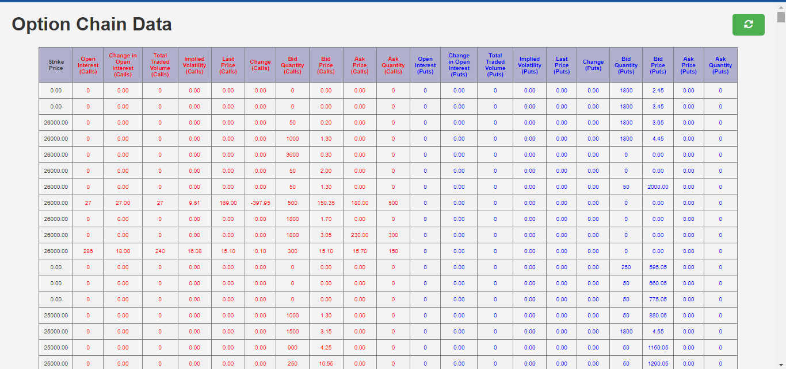
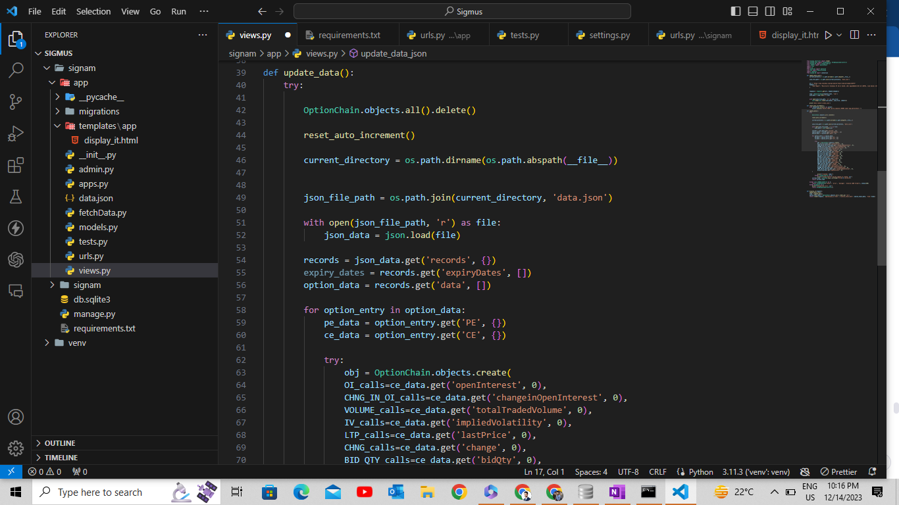

# Option Chain Data Display using Django

## Overview

This project utilizes the Django web framework to display and update option chain data obtained from NSE India's API. The data is stored in a JSON file named "data.json" and processed to update the Django database.

## Key Components

1. **Django Framework:**
   - The project leverages Django, a Python web framework, for efficient web development.

2. **Data Source:**
   - Option chain data is obtained from NSE India's API and stored in a JSON file named "data.json."

3. **Update Process:**
   - The "update_data" view reads data from "data.json" and updates the Django database using the "OptionChain" model.

4. **Database Model:**
   - The "OptionChain" model defines the database structure to store option chain data.

5. **Display View:**
   - The "display_it" view fetches option chain data from the database and renders it on an HTML template.

6. **HTML Template:**
   - The "display_it.html" template structures and styles the displayed option chain data for presentation on a web page.

7. **GitHub Repository:**
   - The codebase is hosted on GitHub under the repository named "-Option-Chain-Data-Display-using-Django."

## Workflow

1. Data is fetched from NSE India's API and stored in "data.json."
2. The "update_data" view processes "data.json" and updates the database.
3. The "display_it" view fetches the updated data from the database.
4. The web interface presents the option chain data to users.

## Getting Started

Follow these steps to set up and run the project locally:

1. **Clone the repository:**

    ```bash
    git clone https://github.com/yourusername/-Option-Chain-Data-Display-using-Django.git
    cd -Option-Chain-Data-Display-using-Django
    ```

2. **Install dependencies (consider using a virtual environment):**

    ```bash
    pip install -r requirements.txt
    ```

3. **Run migrations:**

    ```bash
    python manage.py migrate
    ```

4. **Update option chain data:(NOT NECESSARY AS IT WILL BE DONE AUTOMATICALLY WHILE CALLING)**

    ```bash
    python manage.py update_data
    ```

5. **Run the development server:**

    ```bash
    python manage.py runserver
    ```

6. **Open your browser and navigate to [http://localhost:8000/display/](http://localhost:8000/display/) to view the option chain data.**


7. **Here is how the file structure looks like**

## License

This project is licensed under the [MIT License](LICENSE).
